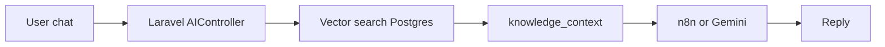

# CodeCraft AI — Knowledge RAG (pgvector)

The AI Instructor can answer questions about **your real site data**: tracks, modules, lessons, and lesson content — using **PostgreSQL + pgvector** and **Gemini embeddings**.

## How it works

1. `php artisan knowledge:embed` reads modules & lessons from your DB, chunks text, calls **Gemini embed API**, stores vectors in `knowledge_chunks`.
2. On each chat message, Laravel embeds the user question, runs **vector similarity search**, builds a `knowledge_context` string.
3. That context is sent to **n8n** (`knowledge_context` field) or injected into the **Gemini fallback** prompt.



## Requirements

- **PostgreSQL** with **pgvector** extension.
- **GEMINI_API_KEY** in `backend/.env` (same key as chat; used for embeddings).

**Hosted database (recommended if local pgvector/pgAdmin is painful):** use **[Supabase](SUPABASE.md)** — entire CodeCraft DB + vectors in the cloud. No local Postgres required.

**Local Docker:** use `pgvector/pgvector:pg16` in `docker-compose.yml` (already configured in this repo).

## Setup

### 1. Environment

Add to `backend/.env`:

```env
GEMINI_API_KEY=your_key
GEMINI_EMBEDDING_MODEL=gemini-embedding-001
GEMINI_EMBEDDING_DIMENSIONS=768

KNOWLEDGE_RAG_ENABLED=true
KNOWLEDGE_TOP_K=5
KNOWLEDGE_MIN_SIMILARITY=0.35
```

### 2. Migrate

```bash
cd backend
php artisan migrate
```

Creates `knowledge_chunks` with `embedding vector(768)` and an index.

### 3. Seed course data (if empty)

```bash
php artisan db:seed
```

### 4. Build embeddings

```bash
php artisan knowledge:embed --fresh
```

- `--fresh` clears old chunks before re-indexing.
- Run again after you add/change modules or lessons.

### 5. n8n (optional)

Re-import `n8n/codecraft-ai-teacher.workflow.json` so the Gemini prompt uses `knowledge_context` from Laravel.

## What gets indexed

| Source | `source_type` | Content |
|--------|---------------|---------|
| Site catalog | `site` | All tracks, modules, lesson counts |
| Each module | `module` | Title, track, description, ordered lesson list |
| Each lesson | `lesson` | Title, module, description, chunked lesson HTML (plain text) |

## Configuration

| Variable | Default | Purpose |
|----------|---------|---------|
| `KNOWLEDGE_RAG_ENABLED` | `true` | Turn retrieval on/off |
| `KNOWLEDGE_TOP_K` | `5` | Max chunks per question |
| `KNOWLEDGE_MIN_SIMILARITY` | `0.35` | Minimum cosine similarity |
| `KNOWLEDGE_CHUNK_SIZE` | `1500` | Characters per lesson chunk |
| `KNOWLEDGE_EMBED_DELAY_MS` | `150` | Delay between embed API calls |

## Example questions (after embed)

- "What Python modules do you have?"
- "Which module teaches variables?"
- "What is the next lesson after loops in Python?"
- "How many lessons are in the Java track?"

## Troubleshooting

| Issue | Fix |
|-------|-----|
| `knowledge:embed requires PostgreSQL` | Set `DB_CONNECTION=pgsql` |
| Extension `vector` does not exist | Use Postgres with pgvector installed |
| Embedding API fails | Check `GEMINI_API_KEY`, quota, model name |
| AI ignores site data | Run `knowledge:embed --fresh`; check `KNOWLEDGE_RAG_ENABLED` |
| n8n ignores context | Re-import workflow; ensure Laravel sends `knowledge_context` |

## Re-index when content changes

After editing lessons/modules in admin or seeders:

```bash
php artisan knowledge:embed --fresh
```

Consider a nightly cron or deploy hook in production.
