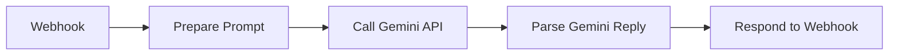

# CodeCraft AI Teacher — n8n workflow v2

New workflow: **`n8n/codecraft-ai-teacher.workflow.json`**

Uses the **same Gemini REST API** as Laravel (HTTP Request + Header Auth). No LangChain Gemini node — fewer “empty reply” issues between test and production.

---

## Import (5 minutes)

### 1. Import workflow

1. n8n → **Workflows** → **⋯** → **Import from file**
2. Choose `n8n/codecraft-ai-teacher.workflow.json`
3. If an old “CodeCraft AI Teacher” exists, **deactivate/delete** it first (avoid two webhooks on `ai-teacher`)

### 2. Create API credential

1. n8n → **Credentials** → **Add credential**
2. Type: **Header Auth** (or “HTTP Header Auth”)
3. Set:
   - **Name:** `x-goog-api-key`
   - **Value:** your key from [Google AI Studio](https://aistudio.google.com/apikey)
4. Save as e.g. `Google Gemini API Key`

### 3. Attach credential

1. Open workflow → **Call Gemini API** node
2. **Authentication** → select your Header Auth credential
3. Save workflow

### 4. Publish

1. **Published** → **OFF**, then **ON** (re-publish after any change)
2. **Webhook** node → copy **Production URL**:
   - `https://saikatn8n.app.n8n.cloud/webhook/ai-teacher`

### 5. Laravel `.env`

```env
N8N_WEBHOOK_URL=https://saikatn8n.app.n8n.cloud/webhook/ai-teacher
N8N_WEBHOOK_TIMEOUT=90
GEMINI_API_KEY=your_key
GEMINI_MODEL=gemini-2.0-flash
```

```powershell
cd backend
php artisan config:clear
```

---

## Test production (no “Listen for test event”)

```powershell
curl -X POST "https://saikatn8n.app.n8n.cloud/webhook/ai-teacher" `
  -H "Content-Type: application/json" `
  -d "{\"message\":\"How many Python lessons are on CodeCraft?\",\"user_id\":5}"
```

Expected:

```json
{"success":true,"reply":"..."}
```

With RAG (like the app):

```powershell
curl -X POST "https://saikatn8n.app.n8n.cloud/webhook/ai-teacher" `
  -H "Content-Type: application/json" `
  -d "{\"message\":\"How many python lessons are here?\",\"user_id\":5,\"knowledge_context\":\"[1] Introduction to Python - 3 lessons\"}"
```

---

## Workflow flow (linear — no branches)



**Important:** Every path must reach **Respond to Webhook**. If you see *“No Respond to Webhook node found”*, a branch was disconnected — re-import `codecraft-ai-teacher.workflow.json` v2.1.

| Node | Role |
|------|------|
| **Prepare Prompt** | Reads `body.message`, `user_id`, `knowledge_context`; builds prompt |
| **Call Gemini API** | `POST …/models/gemini-2.0-flash:generateContent` |
| **Parse Gemini Reply** | Reads `candidates[0].content.parts[0].text` or API error |
| **Respond to Webhook** | `{ "success": true, "reply": "..." }` |

---

## Change model

Open **Prepare Prompt** → edit line `model: 'gemini-2.0-flash'` to e.g. `gemini-1.5-flash`, or change URL in **Call Gemini API**. Re-publish.

---

## If n8n still fails

Laravel falls back to **direct Gemini** when `GEMINI_API_KEY` is set and n8n returns an error placeholder.

Check **Executions** → **Call Gemini API** for HTTP status and error JSON.
